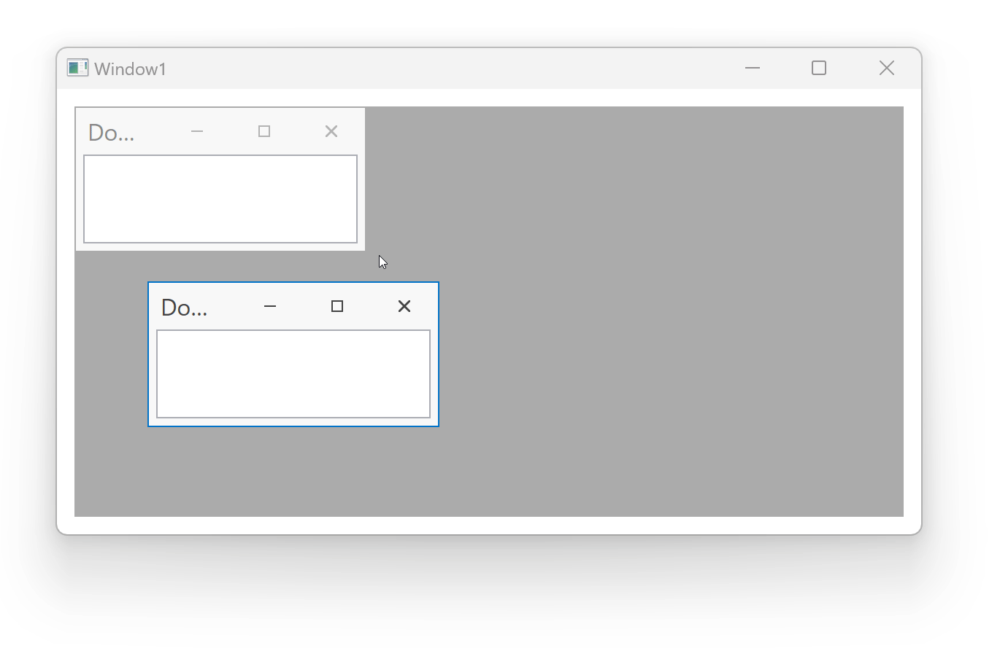

<!-- default badges list -->

<!-- default badges end -->
# WPF Dock Layout Manager - Animate DocumentPanels in MDI Mode

This example animates [DocumentPanels](https://docs.devexpress.com/WPF/DevExpress.Xpf.Docking.DocumentPanel) in [DockLayoutManager](https://docs.devexpress.com/WPF/DevExpress.Xpf.Docking.DockLayoutManager) in Multi-Document Interface (MDI) mode. To create animation effects, create an implicit style for the [DocumentPanel](https://docs.devexpress.com/WPF/DevExpress.Xpf.Docking.DocumentPanel). This style uses triggers that are set to the following properties to run the animation:

- IsMaximized
- IsMinimized
- Closed

## Files to Look At

* [MainWindow.xaml](./CS/DocumentGroup_MDI_Ex/MainWindow.xaml) (VB: [MainWindow.xaml](./VB/DocumentGroup_MDI_Ex/MainWindow.xaml))
* [MainWindow.xaml.cs](./CS/DocumentGroup_MDI_Ex/MainWindow.xaml.cs) (VB: [MainWindow.xaml.vb](./VB/DocumentGroup_MDI_Ex/MainWindow.xaml.vb))

## Documentation

- [Multiple-Document Interface (MDI)](https://docs.devexpress.com/WPF/7209)
